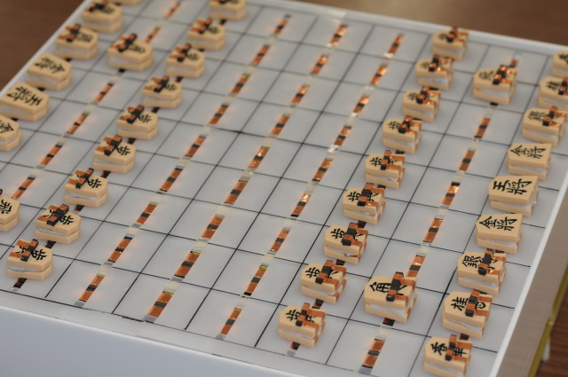

誰でもさせるガイド付き将棋システム
====
初心者でも、実物の駒と盤を使って将棋を楽しめるシステム

## Demo

## Description
駒を持つと、その駒の動けるマスが光り、初心者でも簡単に将棋を楽しめます。 
実機がないため、将棋システムの全てを扱うことはできませんが、
Raspberry Pi上で動いている将棋のプログラムは体験できます。 
shogi.outを実行することで、将棋のプログラムをターミナル上で動かせます。

## Requirement
「shogi.c」は、Raspberry Pi上で動くことを想定しているため、通常のPCではコンパイルできません。
